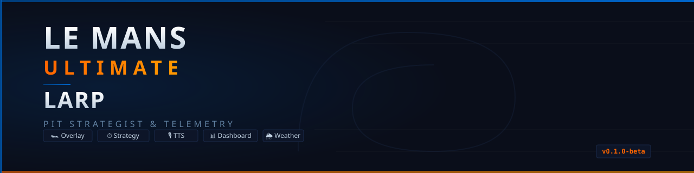

<p align="center">
  
</p>

<p align="center">
  <strong>Pit Strategist for Le Mans Ultimate</strong><br>
  In-game overlay · Race Engineer TTS · Pit Strategy DP · Web Dashboard<br>
  <em>Telemetry &amp; Race Strategy — local, offline-first, free</em>
</p>

<p align="center">
  
  
  
  
</p>

---

Tool locale per **Le Mans Ultimate (LMU)** che legge telemetria in tempo reale, archivia giri, analizza degrado gomme e consumi, calcola strategia di gara ottimale e mostra overlay live + UI web.

---

## Funzionalità

| Cosa | Dettaglio |
|---|---|
| **Telemetria live** | Legge shared memory LMU via `pyLMUSharedMemory` (vendorizzata) |
| **Dati sintetici** | `SyntheticReplaySource` per sviluppo e test senza gioco |
| **Overlay live** | PySide6 trasparente always-on-top: modulare (13 finestre) o full (griglia 3×3) |
| **Race Engineer TTS** | Voce ingegnere di pista con edge-tts + audio cues |
| **Pit Strategist** | Dynamic Programming per soste ottimali (giri fissi o a tempo) |
| **Degrado gomme** | Regressione Huber congiunta carburante + età gomma + cliff detection |
| **Compound planner** | Mescola consigliata per ogni stint in base a meteo + degrado storico |
| **Multi-class** | Hypercar / LMP2 / GT3 detection con mappatura 50+ auto |
| **Qualifying analysis** | Classificazione outlap/hotlap/inlap + fuel saving + tyre temp window |
| **Practice advisor** | Analisi copertura dati (fuel range, tyre age, compound) |
| **Meteo** | Previsione stint-by-stint + weather radar pioggia |
| **Anomaly detection** | MAD z-score robusto su passo e consumi |
| **Micro-sectors** | 9 sub-sectors per giro (3 per settore) + optimal lap assembly |
| **Race status live** | Posizione overall + classe, giro/totale, tempo di gara, gap avanti/dietro/leader, bandiere (gialla/FCY/rossa) con alert TTS |
| **Race Director** | Timeline completa gara: stint, pit stop, meteo, eventi |
| **UI web** | FastAPI locale: Profilo, Archivio, Strategia, Setup, Race Director, Comparatore |
| **43 API REST** | Filtri, export/import `.lmubundle`, cloud sync opzionale (Turso) |
| **Auth** | Email+password (bcrypt) + Google OAuth placeholder + JWT |
| **Security** | CSP headers, rate limiting, input validation, self-audit |
| **Pit practice** | Analisi performance pit stop con suggerimenti |

---

## Quick Start

```powershell
# Clona e installa
git clone https://github.com/Boschi404/LMU-LarpTimes.git
cd LMU-LarpTimes
python -m venv .venv
.\.venv\Scripts\Activate.ps1
pip install -r requirements.txt

# Avvia UI web (senza gioco)
python run_server.py
# → http://127.0.0.1:8000

# Avvia tutto (server + overlay)
python run_app.py
```

---

## Test

```powershell
pytest -q
# 325 passed, 0 failed
```

---

## Architettura

```
Processo A (overlay in-game):
  LMU → SharedMemory → TelemetrySource
                      → LapBoundaryDetector → SQLite (WAL)
                      → Overlay PySide6 + Audio cues

Processo B (web server):
  SQLite → FastAPI (127.0.0.1:8000)
         → Pagine: Profilo, Archivio, Strategia, Setup, Race Director
```

I due processi condividono solo il DB SQLite — **zero IPC**.

---

## Struttura

```
├── analysis/       # Modelli: degrado, strategist, compound, meteo, qualifying
├── auth/           # Auth: bcrypt + JWT + Google OAuth
├── database/       # SQLite WAL: schema, CRUD, export/import, cloud sync
├── overlay/        # PySide6 overlay: full, modulare, shared, TTS, refresher
├── security/       # Self-audit all'avvio
├── telemetry/      # Shared memory source (live + synthetic), lap detector
├── web/            # FastAPI server + Jinja2 templates + vanilla JS frontend
├── vendor/         # pyLMUSharedMemory, pyRfactor2SharedMemory
├── tests/          # 325 test
└── assets/         # Logo, banner, social preview
```

## License

MIT — Boschi404
